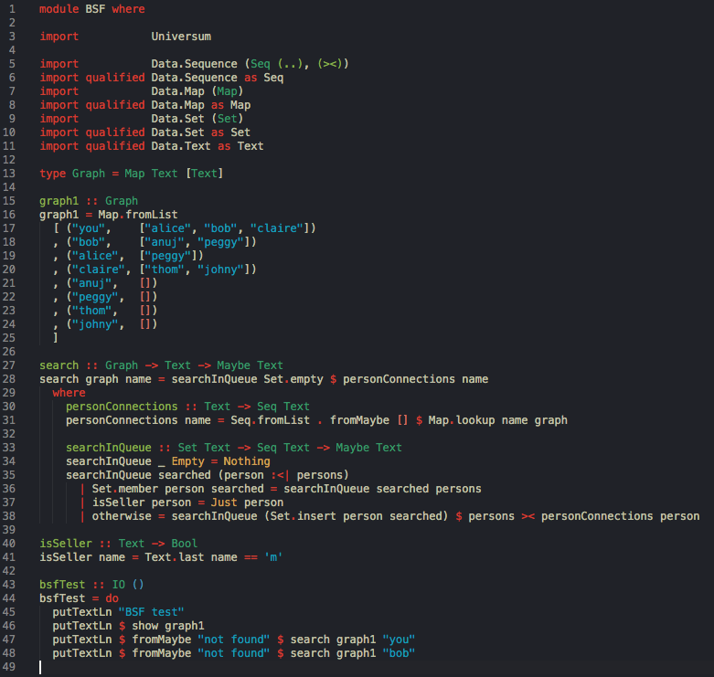

# README

## Color theme

**Mystic color theme for Visual Studio Code**

Tested with Haskell, PureScript, Idris, Clojure, Python, Ruby, JavaScript, HTML, CSS among others.

My theme is a result of years of experiments and adjustments and it's a color scheme I use everyday.

### Example

### Principles

- Main principle - pleasant and not tiring to eyes
- Dark theme - personal preference
- Medium contrast - to reduce eye's fatigue but stays clear
- Medium color saturation - for a pleasant look
- Grey-bluish background - neutral but pleasant look
- Extensive use of green and yellow to red range for syntax - warm but non-intrusive
- String and numeric literals with a very different color - blue and vivid green respectively
- Punctuation marks, operators and keywords easily distinguishable - red
- Types easily distinguishable from values - green vs pale yellow
- Gutters, frames, highlights in a very neutral and low contrast color - for low distraction
- Comments in pure grey to emphasise syntactic insignificance

### Inspiration

- Background - from Atari Basic / Amos Basic / Turbo Pascal (but strongly neutralized towards grey)
- Color palette - very loosely inspired by Groovebox family
- Principled approach - Solarized dark

### Links

[Theme colors settings](https://code.visualstudio.com/api/references/theme-color)

### Feedback

Your feedback is very welcome. If you find that in your workflow my theme does not work perfectly -
please send me a screenshot or give me some suggestions.

**Enjoy!**
